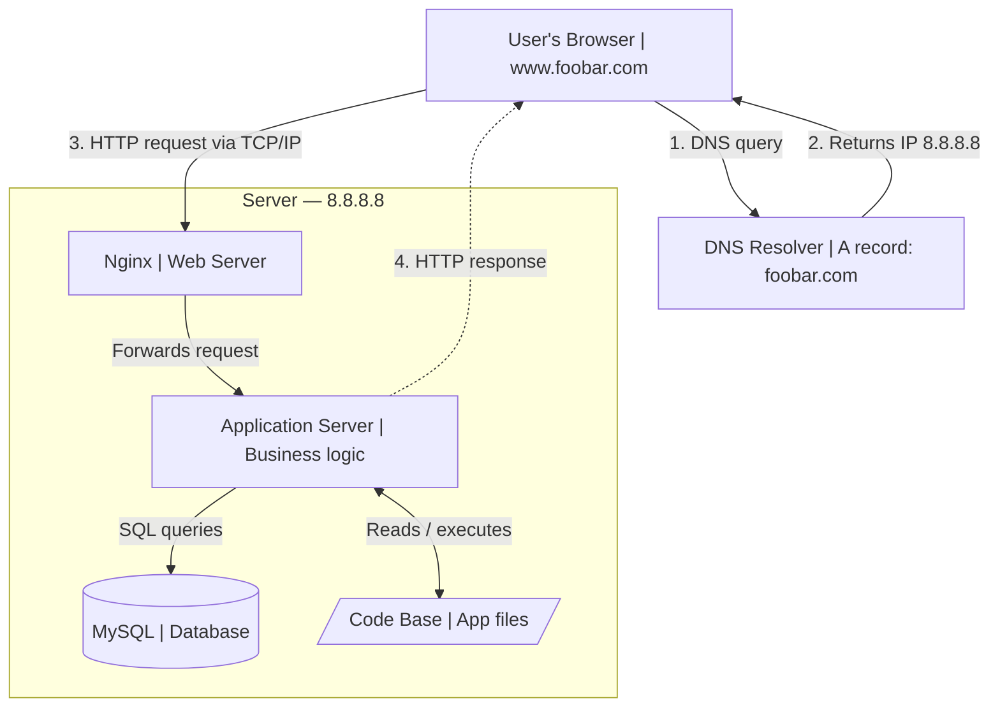

## How the request flows
A user opens their browser and types www.foobar.com. 
Their OS first needs the IP address — it queries a DNS resolver, which looks up the www record 
for foobar.com and returns 8.8.8.8. The browser then opens a TCP connection to 8.8.8.8 and sends an HTTP/HTTPS request.

## Infrastructure specifics
### - What is a server? 
A server is a physical or virtual computer that permanently runs software to respond to network requests. It has an IP address (8.8.8.8 here), CPU, RAM, storage, and a persistent internet connection.

### - Role of the domain name
foobar.com is a human-readable alias that maps to an IP address. Without it, users would need to memorize 8.8.8.8. The domain also enables things like email routing and subdomains.

### - DNS record type for www
www is an A record (Address record). It maps the hostname www.foobar.com directly to an IPv4 address (8.8.8.8). It could also be a CNAME, but a direct A record is most common here.

### - Role of the web server (Nginx) 
Nginx is the first component to receive the HTTP request. It handles TLS termination, serves static files (CSS, images, JS) directly, and forwards dynamic requests to the application server via a protocol like FastCGI or a reverse-proxy pass.

### - Role of the application server
It runs the actual business logic (e.g. a Python/PHP/Ruby app). It processes the dynamic request, reads or writes to the database, and generates the HTML response that gets passed back through Nginx to the user.

### - Role of the database (MySQL)
It persistently stores all structured application data (users, posts, orders, etc.). The app server queries it using SQL and MySQL handles indexing, transactions, and data integrity.

### - Communication protocol 
The server and user communicate over TCP/IP (HTTP or HTTPS on port 80/443). TCP guarantees ordered, reliable packet delivery; IP routes packets across the internet.

## Known issues
### SPOF (Single Point of Failure) 
There is exactly one server. If the NIC fails, the CPU overheats, or the OS crashes, the entire site goes down. There is no redundancy anywhere in the stack.

### Downtime on maintenance  
Deploying new code typically requires restarting Nginx or the app server process. During that window — even if it's only a few seconds — the site is unavailable. There is no way to do a rolling deploy.

### Cannot scale  
All traffic hits one machine. If a traffic spike exceeds the server's CPU, RAM, or network bandwidth, requests will time out. There is no load balancer, no horizontal scaling, and no CDN to distribute load.
