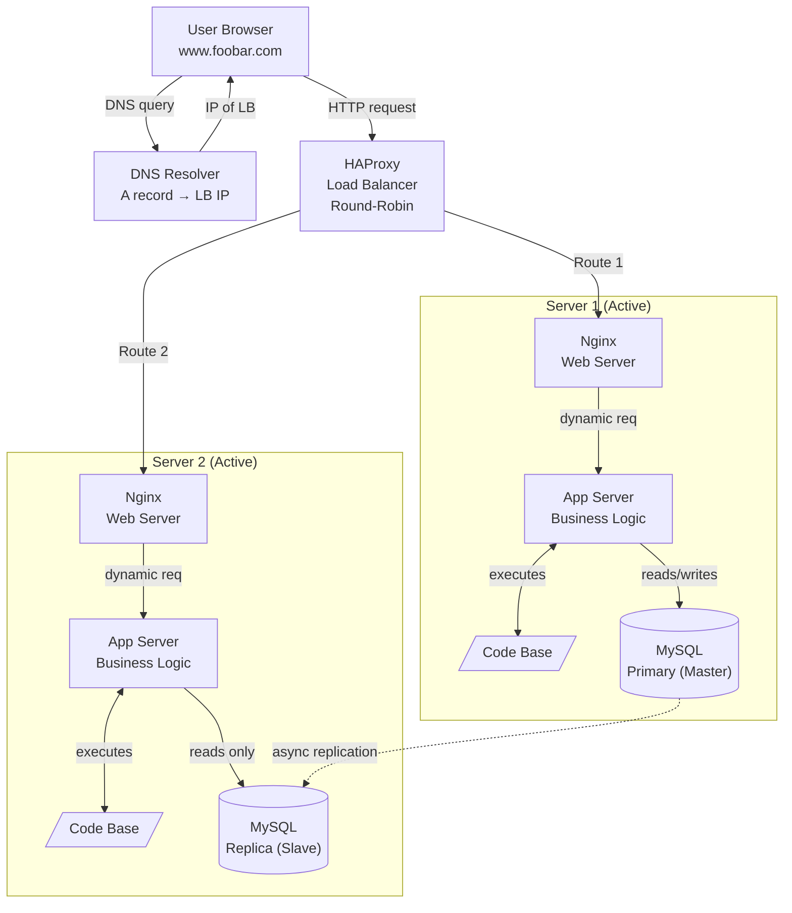

# Explanations

## Why the Load Balancer?
HAProxy sits in front of both servers and distributes incoming HTTP requests between them. It eliminates the single-point-of-failure at the server level and multiplies throughput capacity.

## Distribution algorithm
Round-Robin: each new request is forwarded to the next server in a rotating sequence. Request 1 → Server 1, Request 2 → Server 2, Request 3 → Server 1… Assumes equal server capacity.

## Active-Active vs Active-Passive
Active-Active: both servers handle live traffic simultaneously (our setup). Active-Passive: one server handles traffic, the standby only takes over on failure. A-A gives higher throughput; A-P gives simpler failover.

## Why a second server?
The second server removes the single point of failure from the application tier. If Server 1 goes down, HAProxy routes all traffic to Server 2 without user impact.

## Primary-Replica: how it works
Every write on the Primary is recorded in a binary log (binlog). The Replica continuously streams this log and replays operations to stay in sync. Replication is asynchronous by default.

## Primary vs Replica — app perspective
The app directs all writes (INSERT, UPDATE, DELETE) to the Primary. Read-heavy queries (SELECT) can be load-balanced to the Replica, reducing load on the Primary and improving read throughput.

## Why two Nginx instances?
Each server needs its own web server to receive forwarded requests from HAProxy, handle TLS if configured, serve static assets, and proxy dynamic traffic to its local app server.

## Why duplicate code bases?
Each app server must have a local copy of the code base to execute independently. In practice these are kept in sync via a deployment pipeline (e.g. git pull, rsync, or Ansible).

# Issue:

## SPOF — Load Balancer
HAProxy is a single instance. If it crashes, 100% of traffic is dropped. Needs a second HAProxy with keepalived/VRRP to be truly fault-tolerant.

## SPOF — Primary DB
Only the Primary accepts writes. If it fails, the site becomes read-only (or fully down) until the Replica is manually promoted to Primary.

## No firewall
All ports on all servers are publicly exposed. An attacker can reach MySQL (3306), internal APIs, or admin dashboards directly from the internet.

## No HTTPS / TLS
Traffic between the user and HAProxy is plain HTTP. Passwords, session tokens, and personal data are transmitted in cleartext and can be intercepted (man-in-the-middle).

## No monitoring
There are no agents (Datadog, Prometheus, etc.) collecting CPU, memory, disk, or error metrics. Failures are discovered by users, not by alerts. Capacity planning is impossible.

## Replication lag
Async replication means the Replica can be seconds behind the Primary. A read on the Replica immediately after a write may return stale data.
