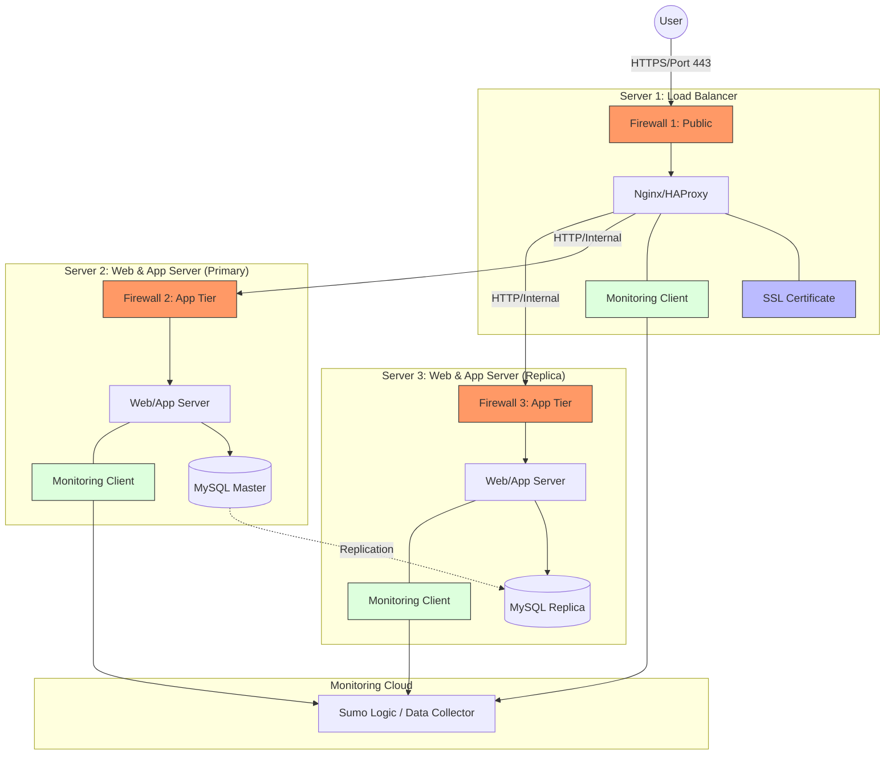

# Explanations

## What are firewalls for?
Firewalls act as a gatekeeper for network traffic. They use a set of defined security rules to allow or block incoming and outgoing packets. In this setup, they protect servers from unauthorized access and common network-based attacks (like port scanning or SSH brute-forcing).
Why is traffic served over HTTPS?
HTTPS ensures that communication between the user’s browser and the server is encrypted. This prevents "Man-in-the-Middle" (MITM) attacks where an attacker could sniff sensitive data like login credentials or personal info. It also provides authentication, proving the user is actually talking to foobar.com.

## What monitoring is used for?
Monitoring provides visibility into the system’s health. It allows us to:
•	Detect Failures: Know immediately if a service goes down.
•	Performance Tracking: See if the site is getting slow.
•	Security Auditing: Spot unusual traffic patterns or unauthorized login attempts.

## How the monitoring tool collects data?
The monitoring client (agent) runs as a background process on each server. It periodically "scrapes" local metrics (CPU usage, RAM, disk I/O) and parses log files (Nginx access logs, system logs). This data is then pushed to a centralized dashboard (like Sumo Logic) via an API.

## How to monitor Web Server QPS?
To monitor Queries Per Second (QPS), the monitoring client must parse the Web Server's access logs (e.g., /var/log/nginx/access.log). By counting the number of log entries generated per second, the tool can graph the request rate in real-time.

# Potential Issues & Constraints

## Why terminating SSL at the Load Balancer level is an issue?
While "SSL Termination" offloads the decryption work from the application servers, it means the traffic traveling internally from the Load Balancer to the Application Servers is unencrypted (HTTP). If an attacker breaches the internal network, they could sniff this plain-text traffic.

## Why having only one MySQL server capable of accepting writes is an issue?
This creates a Single Point of Failure (SPOF) for data modification. If the primary database server fails, the application can no longer save new data or process sign-ups, even if the replica is still up for reading.

## Why having servers with all the same components is a problem?
When every server runs the Database, Web Server, and App Server together, they compete for the same resources (CPU/RAM). A spike in database indexing could starve the web server of resources, crashing the whole node. It also makes "Horizontal Scaling" difficult because you cannot scale the database layer independently of the web layer.
