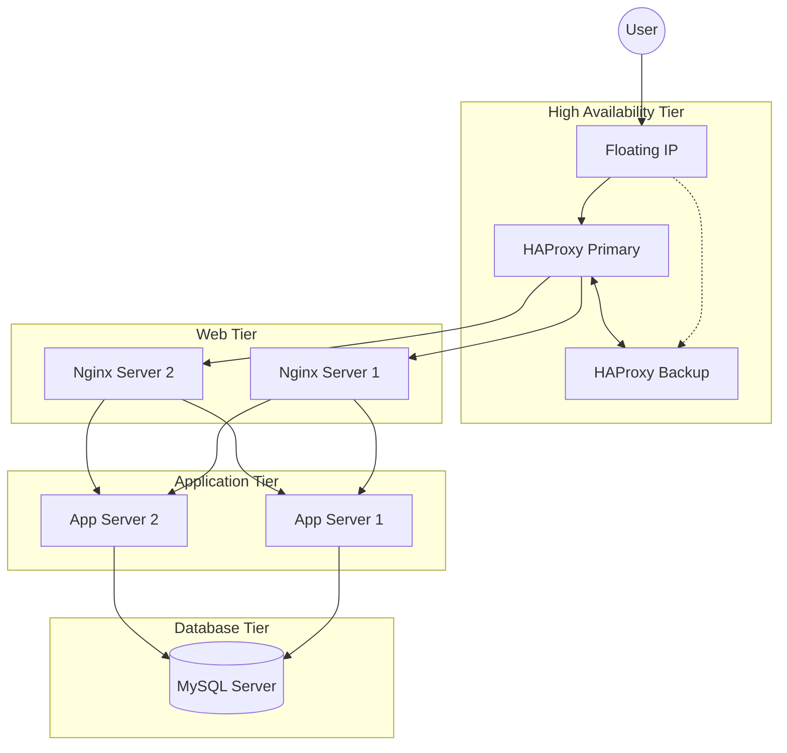

# Scale Up Infrastructure
Scaling up involves moving from a "monolithic" server design (where one server does everything) to a distributed architecture. By isolating specific roles—web, application, and database—we improve performance, security, and maintainability.

# Infrastructure Design
In this design, we decouple the services. Instead of having multiple servers that each run a copy of the entire stack, we group servers by their specific function.
	1.	Load Balancer Cluster (2 Servers): Two HAProxy servers configured in a cluster (Active-Passive or Active-Active).
	2.	Web Server Tier: Servers dedicated solely to handling HTTP requests and serving static content.
	3.	Application Server Tier: Servers dedicated to executing the backend code (PHP, Python, Node.js, etc.).
	4.	Database Tier: A dedicated server (or cluster) for MySQL.

# Components Added & Rationale
## 1. Additional Server
As we split the components, we add hardware to ensure that the Database and Application layers are not competing for the same CPU and RAM. This additional server allows us to host the Database on its own dedicated machine, which is critical for data integrity and speed.
## 2. Load Balancer Cluster (HAProxy)
In the previous design, the single Load Balancer was a Single Point of Failure (SPOF). By adding a second HAProxy server and configuring them as a cluster (using tools like Keepalived or VRRP), we ensure high availability. If the primary Load Balancer fails, the "Floating IP" moves to the second one instantly.
## 3. Split Components (Web, App, and Database)
Breaking the stack into separate tiers provides several advantages:
•	Scalability: If the website has many images, you can add more Web Servers. If the backend calculations are slow, you can add more Application Servers without touching the rest of the stack.
•	Security: You can place the Database and Application servers in a private subnet, allowing only the Web servers to talk to them. The Database is no longer exposed to the public internet at all.
•	Optimization: You can configure the Database server with high-speed SSDs and high RAM, while the Web servers can be optimized for high network throughput.
Application Server vs. Web Server
It is important to distinguish between these two roles as they are now on separate machines:
•	Web Server: Its primary job is to handle the HTTP protocol. It serves static files (HTML, CSS, Images) and acts as a reverse proxy, passing "dynamic" requests to the Application Server. Examples: Nginx, Apache.
•	Application Server: This is where the "business logic" lives. It interacts with the database and processes the code to generate dynamic content. It often speaks protocols like FastCGI or WSGI. Examples: Gunicorn, Puma, PHP-FPM.
